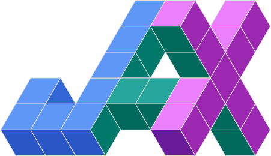

 
  <h1 align="center"> $\text{Hi there, I am \ket{Gopal}}$👋</h1> 
  

    
  
 

Hi there! I am a Quantum Machine Learning enthusiast with experience in related research areas. I am currently looking to collaborate with like-minded individuals to advance the field and learn new things.

- 🔭 I am actively seeking PhD opportunities in Quantum Computing and Algorithms, Variational Methods, Quantum Machine Learning.
- 🌱 I am constantly learning new topics and techniques in Quantum Computing and Algorithms, such as Quantum Noise Mitigation, Quantum Machine Learning and Quantum Chemistry.
- 🧮 I am currently working on Carbon-capture using Quantum Computing. I am also developing algorithms for Measurement based Imaginary Time Evolution (ITE).
- 👯 I am looking to collaborate on research projects related to Quantum Computing and Algorithms.
- 💬 Please feel free to ask me any questions about my research interests and experiences.
- ⚡ Fun fact: Working on quantum computing has left me in a state of entanglement with my research 😂.

<!-- <h1 align="center"> Hi there, I am Gopal. 👋 </h1> -->
<!-- 

  
  
  

 -->
<!--
**Gopal-Dahale/Gopal-Dahale** is a ✨ _special_ ✨ repository because its `README.md` (this file) appears on your GitHub profile.

Here are some ideas to get you started:
-->

<!-- - 🔭 I’m currently working on enhancing my skills in alogrithms on LeetCode.
- 🌱 I’m currently learning ReactJs, Axios, Firebase & REST APIs.
- 👯 I’m looking to collaborate on projects in Machine/ Deep Learning.
- 🤔 I’m looking for help with Dynamic Coloring problem (Fixed Parameter Tractable)
- 💬 Ask me about any tech related stuff
- 📫 How to reach me: [LinkedIn](https://www.linkedin.com/in/gopal-ramesh-dahale-7a3087198/)
- 😄 Pronouns: He/His
- ⚡ Fun fact: blank
 -->

<h1 align='center'> Statistics </h1>

  
  

 

 

<h1 align='center'> Tech Stack </h1>

  <h3>Quantum Programming Libraries</h3>
  

    
    
    
    
    
    
  
 

  <h3>Machine Learning Libraries for Hybrid Computation</h3>
  

    
    
    
    
    
    
  
 

  <h3>Programming Languages</h3>
  

    
    
    
    
  
 

  <h3>Editors</h3>
  

    
    
  
 

 

<h1 align='center'> Connect with me </h1>

  
  

